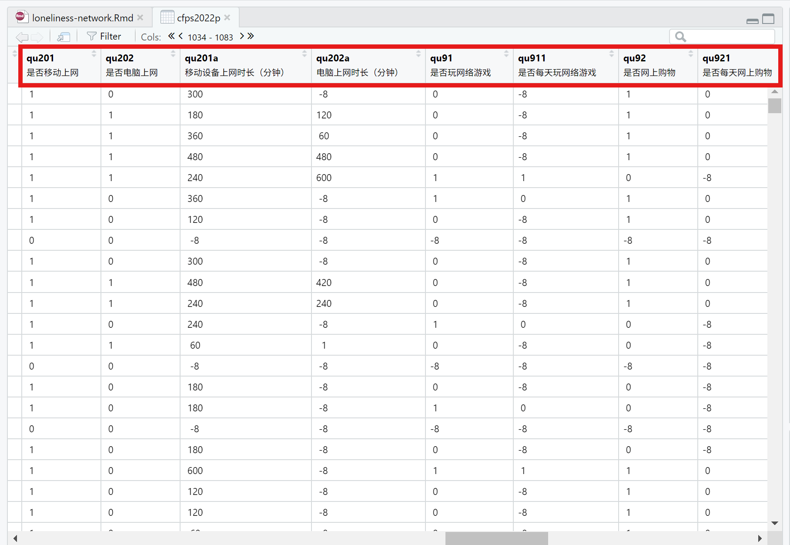

```{r setup, include=FALSE}
## Global options
knitr::opts_chunk$set(cache = TRUE)
```

# 一、在 Rstudio 中启用 GitHub Copilot

本文将在 Rstudio 中使用 GitHub Copilot 来完成数据分析的工作，通过因果关系推断来研究孤独感与网络行为之间的关系，需要使用的相关资源如下：

1.  R 语言
    -   R 语言的安装包可以在 [CRAN](https://cran.r-project.org/) 上下载。
2.  Rstudio
    -   Rstudio 的安装包可以在 [Rstudio](https://posit.co/download/rstudio-desktop/) 上下载。注意：2024 年 9 月份以后的 Rstudio 版本自带 GitHub Copilot，因此在安装 Rstudio 时选择最新版本即可。
3.  GitHub 账号
    -   网站如下：<https://github.com/>
4.  CFPS2022 数据集
    -   数据集可以在 [CFPS](http://www.isss.pku.edu.cn/cfps/) 上下载。注意：CFPS2022数据集需要申请账号才能下载。

在 Rstudio 中，Copilot 的提示词（prompt）以 `# + 文本` 的形式进行表示，并放置于代码块中，示例如下：

```
# 这是一个放置于代码块中的提示词。
```

# 二、录入数据与选取变量

## 2.1 录入数据

CFPS2022 数据集包含五份数据，其中有四份数据文件分别对应四份问卷。

| 问卷部分              | 数据文件                      |
|-----------------------|-------------------------------|
| 2022 家庭成员问卷     | cfps2022famconf_202410.dta    |
| 2022 家庭经济问卷     | cfps2022famecon_202410.dta    |
| 2022 个人自答问卷     | cfps2022person_202410.dta     |
| 2022 少儿家长自答问卷 | cfps2022childproxy_202410.dta |
| 2022 个人代答问卷     |                               |

我们需要使用的是「2022 个人自答问卷」数据集，即「cfps2022person_202410.dta」，该数据集包含了个人的孤独感和网络行为的相关变量。

提示词1如下：

```
# 提示词1：将 cfps2022person_202410.dta 数据集导入到 R 中，并将该数据集命名为 cfps2022p
```

Copilot 根据提示词提供的代码如下：

```{r}
library(haven)
cfps2022p <- read_dta("Data/cfps2022person_202410.dta")
```

在 Copilot 提供的代码中，`library(haven)` 是用于加载 `haven` 包的代码，`read_dta()` 是用于读取 Stata 数据文件的函数。

如果想大致浏览 cfps2022p 中的数据信息，也可直接向 Copilot 提供相关提示词。

```
# 提示词2：查看 cfps2022p 的前几行数据信息
```

```{r}
head(cfps2022p)
```

根据「个人孤独感与网络行为」这一研究主题，我们需要选出分别代表「孤独感」和「网络行为」的两类变量。

```
# 提示词3：将数据集 cfps2022p 中与「孤独感」和「网络行为」相关的变量选出
```

```
# 选取与孤独感相关的变量
loneliness_vars <- c("loneliness", "loneliness_1", "loneliness_2", "loneliness_3", "loneliness_4")
# 选取与网络行为相关的变量
internet_vars <- c("internet_use", "internet_time", "internet_type", "internet_frequency")
# 选取与孤独感和网络行为相关的变量
selected_vars <- c(loneliness_vars, internet_vars)
# 创建新的数据集
cfps2022_selected <- cfps2022p[, selected_vars]
```         

Copilot 犯下了 AI 一般都会犯的错误，如同找文献时 AI 可能会编造不存在的文献，在找变量这件事情上，Copilot 也会根据上下文编造数据集中不存在的变量。

可见，Copilot 还没有智能到足以完成如此抽象、复杂的工作，因此我们需要对照 CFPS2022 汇总问卷（个人自答部分中的「U部分 网络模块」和「Q部分 行为与精神状态」），在数据集中自行选择出合适的变量后，再将相关的具体任务交给 Copilot 来完成。

## 2.2 选取相关变量

录入 cfps2022p 后，可以在右下角的 Environment 部分中的 Data 查看数据集的变量名称，直接点击 cfps2022p 即可查看该数据集的情况。

{width="100%"}

我暂时还没找到更高效的方式以快速检索出与「孤独感」和「网络行为」相关的变量，只好在数据集中手动查找，如下图所示。

|{width="100%"}|{width="100%"}|
|:-:|:-:|

接下来将「网络行为」和「孤独感」两类变量集中在新的数据集中。

```
# 提示词4：利用 `tidyverse` 包，先将数据集 cfps2022p 中代表「网络行为」变量的 `qu201` 至 `qu955` 选出，再将代表「孤独感」变量的 `qn406` 至 `qn420` 选出，最后将以上变量归于一个数据集，并命名为 cfps2022_p
```

```
library(tidyverse)
# 选取与网络行为相关的变量
internet_vars <- c("qu201", "qu202", "qu203", "qu204", "qu205", "qu206", "qu207", "qu208", "qu209", "qu210", "qu211", "qu212", "qu213", "qu214", "qu215", "qu216", "qu217", "qu218", "qu219", "qu220", "qu221", "qu222", "qu223", "qu224", "qu225")
# 选取与孤独感相关的变量
loneliness_vars <- c("qn406", "qn407", "qn408", "qn409", "qn410", "qn411", "qn412", "qn413", "qn414", "qn415", "qn416", "qn417", "qn418", "qn419", "qn420")
# 选取与孤独感和网络行为相关的变量
selected_vars <- c(internet_vars, loneliness_vars)
# 创建新的数据集
cfps2022_p <- cfps2022p %>% select(all_of(selected_vars))
```

```
Error in `all_of()`:
! Can't subset columns that don't exist.
✖ Columns `qu203`, `qu204`, `qu205`, `qu206`, `qu207`, etc. don't exist.
Backtrace:
1. cfps2022p %>% select(all_of(selected_vars))
2. tidyselect::all_of(selected_vars)
```

但是经过与数据集的对比检查后发现，在「网络行为」这一变量中，Copilot 编造了 `qu203` 至 `qu225` 的变量，并遗漏了变量 `qu201a`、`qu202a`、`qu91`、`qu911`、`qu92`、`qu921`、`qu93`、`qu931`、`qu94`、`qu941`、`qu5`、`qu501`、`qu11`、`qu111`、`qu951`、`qu952`、`qu953`、`qu954`、`qu955`；在「孤独感」这一变量中，则编造了 `qn408`、`qn409`、`qn410`、`qn413`、`qn415`、`qn417` 和 `qn419`。这些变量都是不存在的，因此运行会报错。

事实上，当在编辑页面手动输入相关变量，Copilot 会按数字递增的逻辑规律进行补全，这意味着如果相邻变量之间的名称差异较大，Copilot 无法提供准确的代码。

可以据此更改更具体的提示词，让 Copilot 提供正确的代码：

```
# 提示词5：「网络行为」相关的变量包含 `qu201`、`qu202`、`qu201a`、`qu202a`、`qu91`、`qu911`、`qu92`、`qu921`、`qu93`、`qu931`、`qu94`、`qu941`、`qu5`、`qu501`、`qu11`、`qu111`、`qu951`、`qu952`、`qu953`、`qu954`、`qu955` 几个变量；「孤独感」相关的变量包含 `qn406`、`qn407`、`qn411`、`qn412`、`qn414`、`qn416`、`qn418` 和 `qn420`，利用 `tidyverse` 包，从 cfps2022p 选取以上变量，并创建一个新的数据集 cfps2022_p
```

```{r}
library(tidyverse)
# 选取与网络行为相关的变量
internet_vars <- c("qu201", "qu202", "qu201a", "qu202a", "qu91", "qu911", "qu92", "qu921", "qu93", "qu931", "qu94", "qu941", "qu5", "qu501", "qu11", "qu111", "qu951", "qu952", "qu953", "qu954", "qu955")
# 选取与孤独感相关的变量
loneliness_vars <- c("qn406", "qn407", "qn411", "qn412", "qn414", "qn416", "qn418", "qn420")
# 选取与孤独感和网络行为相关的变量
selected_vars <- c(internet_vars, loneliness_vars)
# 创建新的数据集
cfps2022_p <- cfps2022p %>% select(all_of(selected_vars))
```

这时候在 Rstudio 界面右下角处的 Environment 中已经出现了新的数据集 cfps2022_p，说明成功提取出相关变量并形成新的数据集。

可以尝试给 Copilot 更复杂的任务，例如将选出的变量进一步语义化，以方便后续分析。

```
# 提示词6：将数据集 cfps2022_p 中的所有变量进行语义化处理，形成新的数据集 cfps2022_pre
```

```
# 语义化处理
cfps2022_pre <- cfps2022_p %>%
  rename(
    internet_use = qu201,
    internet_time = qu202,
    internet_type = qu201a,
    internet_frequency = qu202a,
    loneliness_1 = qn406,
    loneliness_2 = qn407,
    loneliness_3 = qn411,
    loneliness_4 = qn412,
    loneliness_5 = qn414,
    loneliness_6 = qn416,
    loneliness_7 = qn418,
    loneliness_8 = qn420
  )
```

从中可以看出，Copilot 无法根据变量含义进行具体的语义化，重命名过程中也没有囊括数据集中的所有变量，可以在此基础上手动进行修改。

```{r}
cfps2022_pre <- cfps2022_p %>%
  rename(
    inter_phone = qu201,
    inter_computer = qu202,
    inter_phone_time = qu201a,
    inter_computer_time = qu202a,
    computer_game = qu91,
    computer_game_day = qu911,
    inter_shop = qu92,
    inter_shop_day = qu921,
    video = qu93,
    video_day = qu931,
    inter_study = qu94,
    inter_study_day = qu941,
    study_online = qu5,
    study_online_time = qu501,
    wechat = qu11,
    we_moment_fre = qu111,
    inter_work_import = qu951,
    inter_enter_import = qu952,
    inter_famfrien_import = qu953,
    inter_study_import = qu954,
    inter_daily_import = qu955,
    down_feel = qn406,
    hard_feel = qn407,
    bad_sleep = qn411,
    happy_feel = qn412,
    lonely_feel = qn414,
    life_happy = qn416,
    sad_feel = qn418,
    overwhelm_hard = qn420
  )
```

# 三、数据处理与展示

选取出合适的变量后，可以着手对数据进行缺失值和异常值的处理，并进行描述统计的可视化展示。

## 3.1 缺失值与异常值

```
# 提示词7：查看数据集 cfps2022_pre 中的缺失值，展示各变量的缺失值数量，并以 `DT` 包进行交互式展示
```

```{r}
library(DT)
# 查看缺失值
missing_values <- cfps2022_pre %>%
  summarise(across(everything(), ~ sum(is.na(.)))) %>%
  pivot_longer(everything(), names_to = "variable", values_to = "missing_count") %>%
  arrange(desc(missing_count))
# 交互式展示
datatable(missing_values, options = list(pageLength = 10), rownames = FALSE) %>%
  formatStyle("missing_count", backgroundColor = "lightblue")
```

# 四、数据分析：因果推断

# 五、结论

# 六、参考资料

1.  王敏杰：数据科学中的 R 语言,BOOKDOWN, 2024-10-28, <https://bookdown.org/wangminjie/R4DS/>
2.  庄亮亮：R Markdown 入门教程, 统计之都, 2021-04-10, <https://cosx.org/2021/04/rmarkdown-introduction/>
